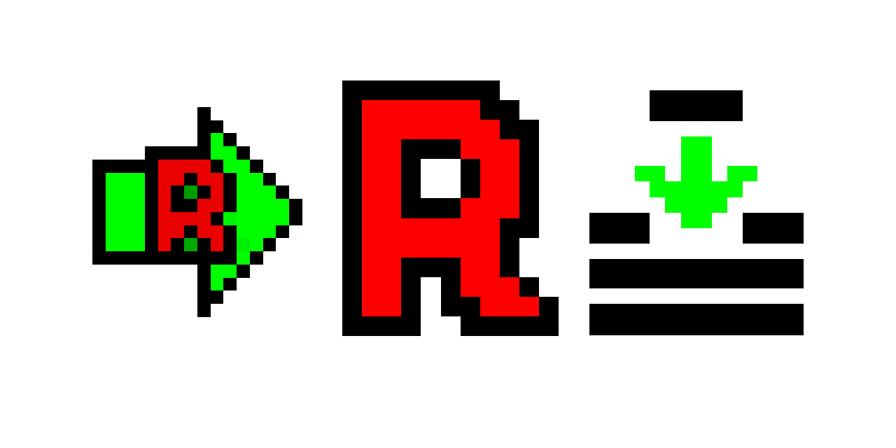

# RAId KNIME Nodes
Le projet vise au développment de noeuds Knime en vue de simplifier l'utilisation du logiciel RAId du NCBI.
En effet, ce logiciel est tout sauf adapté aux biologistes de base qui l'abandonnent au profit de logiciels concurents, ce qui est une erreur car RAId est le meilleur dans son domaine.
Knime est un logiciel de workflows qui permet de lier plusieurs algorithmes les uns aux autres d'une maniere graphique et simple d'utilisation. 
En associant les deux on peu créer un traitements pour plusieurs fichiers, là où RAId n'en traitait qu'un. 
## Auteurs
* ```Arnaud Sénécaut``` _développement java/KNIME._ 
* ```Nicolas Sénécaut``` _consultant, développement C++_
