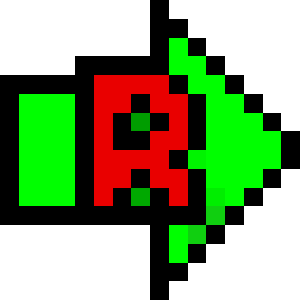

# Sources
Ce dossier contient les sources des différents noeuds KNIME développés.

## Contenu

*  ```extension_RAId``` _Contient les sources du noeud encapsulant l'utilisation de RAId._
*  ```RAId_export``` _Contient les sources du noeud permettrant d'exporter la sortie de fichier de RAId sous divers formats de fichiers._
*  ```make_blast_db``` _Contient les sources du noeud permettant de convertir un fichier de base de donnée en fichier lisible par RAId._
